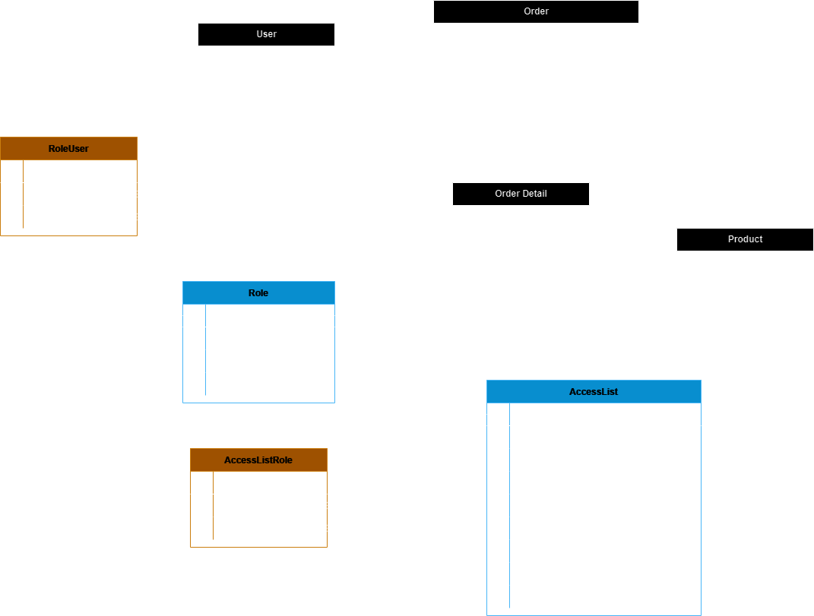

# Mini E-Commerce

Plain simple e-commerce with role based access control, CRUD Products and Order Management (Up to checkout without finance transaction). Using AdminLTE Template for UI and Laravel as Backend Framework that handles both API and Web Application.

## Requirements

 - PHP ^8.1:
		 - make sure those modules are enabled ***bcmath, calendar, Core, ctype, curl, date, dom, exif, fileinfo, filter, gd, hash, iconv, intl, json, libxml, mbstring, mysqli, mysqlnd, oci8, openssl, pcre, PDO, pdo_mysql, pdo_pgsql, Phar, readline, Reflection, session, SimpleXML, sodium, SPL, standard, tokenizer, xml, xmlreader, xmlwriter, xsl, zip, zlib***
 - Composer
 - Git, its optional, you can just download it from this repo
 - MySQL/MariaDB

## Installation

 1. Clone or download (and extract the repo) [this repo](https://github.com/EnKuldes/mini-e-commerce.git) to your desired path.
 2. Open terminal/cmd and change directory to repo directory. Then run the following command

    ``` bash
    # install repo
    composer install
    
    # copy env file
    cp .env.example .env

	# generate app key
	php artisan key:generate
		
    # create symbolic link for storage folder
    php artisan storage:link

    # run migration and seeder, make sure that .env file already being setup (host, password, user, port and database)
    php artisan migrate --seed

    # run laravel passport keys to generate
    php artisan passport:install
    ```

 3. Edit .env file to your need (ex. DB_HOST, DB_PASSWORD, APP_NAME, APP_ENV, etc) using your fav text editor. And if you're on Linux for example using Centos and there is an error on storage kinda things, make sure that selinux(RedHat variant) is allowing to write/read or permission is set to 755(rwx-rw-rw).

And thats it for installation. Next to Usage.

## Usage

If you're using it on local machine, you can run it by this command:
```bash
php artisan serve
```
Then you can access it on http://localhost:8000.

There is 3 user with 3 different roles that I already created, that is:

 - Role Admin with email **Administrator@admin.com** and password **4dm1n987**

> Admin role have permission to access resources management, where admin can create/edit/disable/enable user, role and menu. Mapping user to a role/s and mapping each role to menu/request.

 - Role User with email **user@user.com** and password **u53rtest**

> User can access orders like browsing product, adding/removing product to cart, modify qty on product in cart, checkout cart and see order history.

 - Role Manager with email **Manager@manager.com** and password **m4n46eR**

> Manager role can access Products menu, which can CRUD Products.

On this project, Im also serve REST API with Laravel Passport as authentication. You can read it more in this [link here](https://documenter.getpostman.com/view/10072189/2s9YXe84gG) or import it to Postman.

## About Project

This project is created to fullfill a task for my future employement. For the architecture itself what I have in mind is 1 Server which database server, web server and file/asset are on this server, it would be better if the future architecture split for all those 3 things to reduce workload of server. For example I would love to use SFTP or Cloud to put all the project uploaded files in there as is to reducing storage usage on our infrastructures, adding a load-balancer to make sure even on big traffic the application can still running smoothly.

And for the Reset Password implementation it would be better to add more security like sending mail to the requested user with a link to reset password.

For the database itself, Im making it simple based on task that I given and understood, the ERD itself looks like this:



Table Order have 2 relationship, that is to Table User (Many to One) and Table OrderDetail (One to Many). Since Table Order also functioning as history, im adding indexes both on order_status and order_date becasue those 2 columns would most likely being used as filter to show data using between or other conditionals.

I'm also creating role based access control, with tables like Role, AccessList, RoleUser and AccessListRole. Table AccessList includes record for all of the pages and request. Table RoleUser and AccessListRole is a pivot table that connect between Role with User table and Access List with Role table. With this relationship User can have multiple roles and so role with access list table.

For future improvement adding a category table to describe what are the product caterogized is a good thing as its will help on creating recommendation system.
